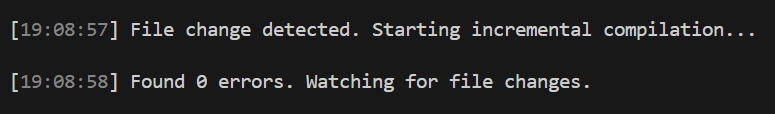

# Лабораторная по scss
- Все задания в [этой директории](scss)
- [Задание 1](scss/1/)
- [Задание 2](scss/2/)
- [Задание 3](scss/3/)
- [Задание 4 (стили для задания 2)](scss/4_2/)
- [Задание 4 (стили для задания 3)](scss/4_3/)
- [Задание 5 (стили для задания 2)](scss/5_2/)
- [Задание 5 (стили для задания 3)](scss/5_3/)

# Лабораторная по TypeScript
- Все задания (кроме 1) в [этой директории](tsc)
- Задание 1 - запущена автоматическая перекомпиляция с помощью `tsc example.ts --watch`

- [Задание 2](tsc/2/)
- [Задание 3](tsc/3/)
- [Задание 4](tsc/4/)
- [Задание 5](tsc/5/)
- [Задание 6](tsc/6/)